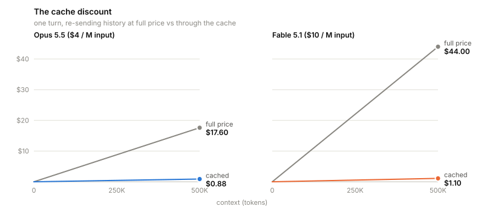
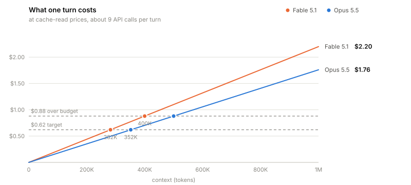
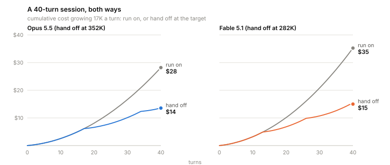

# claude-handoff

A Claude Code plugin that tells you, in session and while there is still
room, that the conversation has grown expensive enough to hand off.

```
218K/256K [========--] handoff in 2  ~$0.38/t opus-5-5 myproject
262K/256K [==========] handoff now  ~$0.46/t opus-5-5 myproject
310K/256K  1.2x over  ~$0.55/t opus-5-5 myproject
218K/256K [========--] handoff in 2  ~$0.38/t opus-5-5 myproject:auth-token
```

## Install

```
/plugin marketplace add bissli/claude-handoff
/plugin install claude-handoff@claude-handoff
```

The first command registers this repo as a plugin source (a
"marketplace"); the second installs the hooks and the `/handoff`
command from it. It needs `python3` 3.11 or later on `PATH` and nothing
else. The status line takes one manual step, described
[below](#status-line-optional-one-manual-step).

## The problem

Claude Code talks to a stateless API: every request re-sends the whole
conversation. A turn - one prompt from you, plus everything Claude does
before it waits for you again - is about 9 requests, one per tool call,
and every one of them re-sends everything that came before it.

<picture>
  <source media="(prefers-color-scheme: dark)" srcset="docs/resend-dark.svg">
  
</picture>

Prompt caching is what makes this affordable at all: a token re-read
from the cache costs a twentieth of a fresh one on Opus 5.5 and a
fortieth on Fable 5.1. The two models this matters most for are Opus
5.5, Claude Code's default, and Fable 5.1, the top tier, which bills
two and a half times as much for a fresh token. Sonnet 5 re-reads
history at Opus 5.5's price, so it is gauged the same way.

<picture>
  <source media="(prefers-color-scheme: dark)" srcset="docs/cache-discount-dark.svg">
  
</picture>

But the discount is not a cure. The cache lowers the price of each
re-read token; it does nothing about the number of tokens re-read, which
grows every turn and never shrinks. Zoom in on the cached lines above
and the climb is still there:

<picture>
  <source media="(prefers-color-scheme: dark)" srcset="docs/cost-per-turn-dark.svg">
  
</picture>

So the plugin warns where a cycle's cost per call of work is lowest,
not at a fixed dollar or token line. Carrying on re-reads a growing
context on every call. Handing off pays a cycle's fixed overhead again:
the resume, the write, and the cache writes of the floor. The point
between the two moves with the resume, the growth rate, and the price
of a cache write against a read. [The handoff point](#the-handoff-point)
has the arithmetic.

Every figure below already includes the cache discount. The bill being
discussed is the discounted one.

## What a turn costs, point by point

One turn costs `context x cache-read rate x 8.8 calls`. The tables show
that cost at each context size and what the same turn would have cost
without the cache. Neither model holds a fixed dollar line: [the
handoff point](#the-handoff-point) moves with the session's own resume
and growth rate, not with a row in this table.

**Opus 5.5** - cache read $0.20 per million tokens:

| context | one turn | without cache | cache saved |
| ------- | --------: | -------------: | -----------: |
| 100K    | $0.18    | $3.52         | $3.34       |
| 200K    | $0.35    | $7.04         | $6.69       |
| 400K    | $0.70    | $14.08        | $13.38      |
| 500K    | $0.88    | $17.60        | $16.72      |
| 700K    | $1.23    | $24.64        | $23.41      |
| 1M      | $1.76    | $35.20        | $33.44      |

**Fable 5.1** - cache read $0.25 per million tokens:

| context | one turn | without cache | cache saved |
| ------- | --------: | -------------: | -----------: |
| 100K    | $0.22    | $8.80         | $8.58       |
| 282K    | $0.62    | $24.82        | $24.20      |
| 400K    | $0.88    | $35.20        | $34.32      |
| 500K    | $1.10    | $44.00        | $42.90      |
| 700K    | $1.54    | $61.60        | $60.06      |
| 1M      | $2.20    | $88.00        | $85.80      |

Read the Fable 5.1 row at 500K: a session parked there pays $1.10 for
every further turn, and the cache is already saving it $42.90 a turn.
Both columns grow together, because both are the same line at
different prices.

## What a whole session costs

Per-turn cost climbs in a straight line, so a session's total climbs as
its square: each new turn costs more than the one before it. Handing off
resets the line; running on rides it up.

<picture>
  <source media="(prefers-color-scheme: dark)" srcset="docs/session-cost-dark.svg">
  
</picture>

Forty turns, growing 17K a turn, starting at the 69K fresh-session
floor, restarting at 72K after each handoff. Writing a handoff spends
about two of those turns, so the held column also buys a little less
finished work, not only fewer dollars:

| 40 turns on | hand off at target | run on to 732K | held vs run on |
| ----------- | ------------------: | --------------: | --------------: |
| Opus 5.5    | $14                | $28            | -52%           |
| Fable 5.1   | $15                | $35            | -57%           |

The cache and the handoff attack different halves of the bill. On the
run-on Fable 5.1 session the cache already turned a would-be $1,410 into
$35; handing off is what turns the $35 into $15. Neither substitutes
for the other.

## The exit: /handoff

The warnings point at `/handoff`, a command the plugin installs. It
writes the session's state - plan, key files with line anchors, settled
decisions, dead ends - to `.handoff/<task-name>/HANDOFF.md`, the folder
named after the task, and a fresh session reads it back and resumes. A
handoff file is 2-5K, exact rather than summarized, and starts a
session that carries nothing else beyond the ~69K floor - the system
prompt, tool schemas, and instruction files every session re-sends in
full.

Using it:

```
/handoff                       writes or updates the handoff, checks it
  (kill the session, start fresh)
/handoff auth-token-refresh    reads that handoff back, resumes its plan
/handoff list                  every handoff here, with plan progress
/handoff check auth-token-refresh    re-reviews one in place
/handoff done auth-token-refresh     marks the thread finished
/handoff --no-check            writes without the reviewer pass
```

(`auth-token-refresh` stands for whatever folder name the writing
session chose.)

- A write cycle ends with a reviewer pass: a fresh agent reads the
  finished file cold and reports what a resuming session could not act
  on. `--no-check` skips the pass, and only the person invoking the
  command may pass that flag. A writing session never rules its own
  cycle too small to review.
- There is no verb to type. A session that edited a file or settled a
  decision holds something worth telling a fresh session, so `/handoff`
  writes; one that only looked something up reads a handoff back
  instead. Where either the verb or the target is ambiguous, it lists
  the candidates and stops rather than guessing.
- The folder outlives any one file. `.handoff/<task-name>/` holds the
  hand-written cursor - task, next step, plan, state, open questions -
  in `HANDOFF.md`; an append-only ledger of the thread's artifacts in
  `ledger.tsv` (which spec, draft, or notes file matters, and whether
  it must be read before the next edit); the settled decisions,
  constraints, and dead ends in `standing.md`, append-only; and every
  finished cycle verbatim under `cycles/`. A small script, `hq.py`,
  which the plugin puts on the agent's PATH as `hq` while it is
  enabled, writes the ledger, renders the generated blocks of
  `HANDOFF.md` from it, and refuses the three edits that lose work over
  many cycles: lowering a spec's or a draft's tier without naming its
  successor, grading a whole file as the contract with no anchor, and
  rewriting a recorded line in place. What the thread made sits in the
  thread folder under `specs/`, `drafts/`, `notes/`, or `outputs/`,
  never loose at its top level, and the ledger points at it. A thread
  whose spec and experiments already live in a project directory pins
  that directory once with `hq work-dir`, and its specs, drafts, and
  outputs go there instead; a pin is the thread's own, and no global
  setting moves every thread at once.
- Run again a session later, it updates the same folder: the cursor
  rewritten, the plan ticked off, decisions and dead ends appended,
  the previous cycle archived. What is no longer live is counted, not
  printed, and what is read at resume is a spec's anchored span, its
  size beside it, never a whole file. The file grows with what stays
  live, not with the cycle count: a thread that supersedes as it goes
  holds its size, and one that accumulates distinct live items pays
  about 58 tokens a cycle for them.
- A thread ends with `/handoff done <task-name>`. The folder survives
  whole and every query verb still answers it, but `/handoff list`
  stops showing it and the next `hq begin` refuses it. `hq list --done`
  names the finished threads, and `hq done <task-name> --undo` reopens
  one. A task leaves the list without its folder being deleted.
- Each write ends with a reviewer pass that must reconstruct the task
  from the file alone. Reading starts with `hq open`, which reports
  drift - a moved commit, a gated file edited since its stamp, a
  heading an anchor no longer finds, a label a re-stamp moved past the
  rendered block - then reads the spans the ledger
  gates and executes the file's next step without re-litigating
  settled decisions.
- Two advisory hooks back it. Once a handoff is opened, at a write in
  reach - under the project root or the thread's pinned work dir - a
  PreToolUse hook names each gated file the session has not read: a
  spec's span at the first such write, a draft at a write to that
  file, each path once. A read is the Read tool, the path as an
  argument of the `cat`, `head`, `tail`, `less`, or `sed -n` that
  names it, or an `hq read` receipt. At the end of a turn, a Stop hook
  says so when `HANDOFF.md` was written by hand since its last
  recorded cycle. Neither blocks; `HQ_GATE=0` in the environment turns
  the first off, and `HQ_GATE_DENY=1` makes it deny the write instead
  of reporting.
- Every line `hq` prints that calls for a move names it, and
  `hq help <topic>` (anchors, kinds, read, rules, stale-path, write) and
  `hq <verb> --help` carry the reference detail the skill file points
  at, so the skill stays short enough to survive a re-attach whole.
- `/handoff when`, `diff`, `artifacts`, and `standing` query the
  ledger: one path's history by any spelling of the path, the cursor
  change between two cycles by section, every live artifact, every
  standing item or one item in full by its id.

Every artifact the ledger records carries a tier, `read_before`, that
says when a session loads it. A spec is the contract and seeds
`always`; a draft seeds `edit`; a note or an output is graded by the
writing session when the cursor points at it.

| tier      | means                     | loaded when                    |
| --------- | ------------------------- | ------------------------------ |
| `always`  | the contract              | every resume, an anchored span |
| `edit`    | read before you change it | the gate, at a write to it     |
| `mention` | know it exists            | on demand, `hq read`           |
| `never`   | on the record             | `hq artifacts`, `hq when`      |

`.handoff/` belongs in the project's gitignore when handoffs should stay
untracked. Versions before 0.3.0 wrote to `working/`, and before 0.2.2
to `scratch/`; move each old folder to `.handoff/<task-name>/` once.
After the move, `hq open` names every cursor line and standing item
that still says `working/<task-name>/` or `scratch/<task-name>/`, unless
that directory is the thread's own pinned work dir, where the paths are
current.

## What you see

At the end of a turn, once as each line is crossed - the handoff point,
then one handoff write past it:

> Context 262K, at the 256K handoff point for this cycle, growing 20K a
> turn - a good point to run /handoff.

> Context 300K, 43K past the 256K handoff point, where a handoff begun
> there would have finished. Every further turn raises the cost of each
> call of work. Run /handoff.

The second also raises a desktop notification.

## The handoff point

The warning sits at the context where a cycle's cost per call of work
is lowest. A cycle runs from a session's first call, or from the first
call after a restart in place, to the handoff that ends it. Every call
bills its whole context at the cache-read price, and every new token
bills once more, at m times that price, when it is written to the
cache. Counted in those read-token units:

```
F   billed context of the cycle's first call
Fw  tokens that first call writes to the cache
C0  billed context at the resume end, call j0
S0  billed context summed over the calls up to and including j0
g   tokens added per call, measured from the transcript
w   calls a handoff write takes: 2 turns x 8.8 = 17.6
W   tokens the write adds: w x g
m   cache-write price / cache-read price

A  = S0 + w x (C0 + W/2) + m x (Fw + C0 - F + W)
H* = C0 + sqrt(2 x g x A)
```

A is what a cycle pays whatever its length: the resume, the handoff
write re-reading the context, and the cache writes of the floor, the
resume, and the handoff. T calls of work re-read `g x T^2 / 2` tokens
on top of C0, so one call of work costs `C0 + w x g + g x T / 2 + A / T`.
That is lowest at `T = sqrt(2 x A / g)`, where the context reaches H*.
The dollar price cancels, and only the ratio m remains.

The resume starts at the cycle's first `hq open`, with `--root` or
`--session` allowed ahead of the verb. It runs through every following
call whose tool uses are all a Read of any path, a Skill or ToolSearch
call, or a Bash command naming `.handoff`, `HANDOFF`, or an hq read verb
(`open`, `read`, `standing`, `artifacts`, `when`, `arc`, `list`, `help`).
j0 is the first call after those, the first to use any other tool or
none. A cycle with no `hq open` has j0 at its first call, so C0 and S0
are both F.

m comes from the model and the cache TTL. A write costs 1.25 times the
base input price at the 5-minute TTL and 2 times at the 1-hour TTL, on
every model. The TTL is the one that carried more of the cycle's cache
writes in each call's `usage.cache_creation` breakdown, and the 1-hour
one Claude Code itself writes at when no call carries a breakdown.

| model                                 | cache read  | m, 5-minute | m, 1-hour |
| ------------------------------------- | ----------- | -----------: | ---------: |
| Opus 5.5                              | 0.05x input | 25          | 40        |
| Fable 5.1                             | 0.025x      | 50          | 80        |
| Opus 5, Fable 5, Sonnet 5, Sonnet 4.6 | 0.1x        | 12.5        | 20        |

Worked values on Opus 5.5 at the 1-hour TTL, with F 62,000, Fw 50,000,
and g 2,300, so W is 40,480 and m is 40:

| C0      | S0        | A          | H*      |
| ------- | --------- | ---------- | ------- |
| 80,000  | 700,000   | 6,803,424  | 256,906 |
| 150,000 | 1,060,000 | 11,195,424 | 376,934 |
| 200,000 | 1,300,000 | 14,315,424 | 456,614 |

What moves the point:

- A longer resume moves it out, and the room past it, H* - C0, grows
  too: each resume token adds w + m to A directly, plus one more
  through its own weight in S0, the sum that already counts it once
  as the resume-end call's own context. A fixed warning point would
  instead take every resume token out of the work room, so each
  handoff's larger resume would shorten the next cycle.
- Faster growth moves it out in tokens and in by calls: the room grows
  as the square root of g, and the count of work calls falls as one
  over that root.
- A dearer cache write moves it out, through m: the 1-hour TTL writes
  at 1.6 times the 5-minute price.
- The dollar price of a model never moves it.

Band 1 sits W past the handoff point, where a handoff begun at band 0
would have finished. Output tokens are left out of A, which places the
point early rather than late. Once band 0 has fired, both points are
latched for the rest of the cycle: either may fall, and neither rises,
because context only grows and a point that moved outward would walk
the gauge backwards. Before band 0 fires, the point follows the
measured rate both ways, so the fallback rate of a cycle's first calls
cannot pin it low. A restart in place releases both latches. Haiku has
no entry in the price table, so the hook says nothing on a Haiku
session.

## Pushing the agent to hand off (optional)

The warnings above reach the terminal, not the agent: a Stop hook
writes its message for whoever reads the screen, so a session runs past
its handoff point while the agent driving it never learns.

Creating `~/.claude/.nudge-handoff` changes that. While the file
exists, a `UserPromptSubmit` hook names the context and the handoff
point to the agent at the top of each turn. It asks for a handoff at
the next natural stopping point rather than at once, and only when work
remains for a later session. A task that is finished and committed, with
nothing left open or unrecorded, needs none. The top of a turn is the
one moment an instruction redirects a turn without interrupting work
already under way.

```
touch ~/.claude/.nudge-handoff    # arm
rm -f ~/.claude/.nudge-handoff    # disarm
ls ~/.claude/.nudge-handoff       # present means armed
```

Presence alone is the switch and it takes effect at the next prompt, so
nothing sticks armed. The hook ignores the contents, which leaves room
for a line recording what the file is for. The nudge keeps no state of
its own. It measures the context from the transcript rather than
trusting the figure the Stop hook stored, because `/clear` leaves that
figure behind it, and it stays silent below the handoff point and
inside an open cycle.

## The math

Anthropic list prices (September 2026), per million tokens:

| model     | input  | cache read | 5-minute write | 1-hour write | output |
| --------- | ------: | ----------: | --------------: | ------------: | ------: |
| Opus 5.5  | $4.00  | $0.20      | $5.00          | $8.00        | $20.00 |
| Fable 5.1 | $10.00 | $0.25      | $12.50         | $20.00       | $50.00 |
| Sonnet 5  | $2.00  | $0.20      | $2.50          | $4.00        | $10.00 |

A cache read is a multiple of the input price, and the multiple is not
the same everywhere: 0.05 on Opus 5.5 and 0.025 on Fable 5.1, against
the 0.1 Sonnet 5 and every earlier model charge. The plugin stores the product, so
a model matched to its family rather than its own generation is priced
at up to two and a half times what it bills.

The cost of one turn, which the status line prints beside the gauge:

```
one turn = context x cache-read price x calls per turn
         = context / 1M x cache-read $/M x 8.8
```

Worked examples:

```
Opus 5.5  at 400K:  0.400 x $0.20 x 8.8 = $0.70 a turn
Fable 5.1 at 400K:  0.400 x $0.25 x 8.8 = $0.88 a turn
```

That figure leaves out cache writes and output. The handoff point
takes cache writes in through m and leaves output out; [The handoff
point](#the-handoff-point) gives the formula.

The defaults, measured from a month of the author's usage - sessions
with different tool habits will measure differently, which is why the
hook re-measures growth per session:

- **8.8** assistant calls per user turn
- **1,900** tokens of growth per call (~17K a turn) until a session has
  history enough to measure its own rate
- **69,000** billed tokens for a fresh session, **123,000** after a
  restart in place

## Glossary

| term             | meaning                                                                                                                  |
| ---------------- | ------------------------------------------------------------------------------------------------------------------------ |
| turn             | one prompt from you plus everything Claude does before waiting again                                                     |
| call             | one API request; each tool use is one, ~9 per turn                                                                       |
| context          | everything re-sent with every call: system prompt, tools, conversation                                                   |
| billed context   | `cache_read + cache_creation + uncached_input` on the last call                                                          |
| cache read       | a re-sent token served from the prompt cache, at 5% of input price on Opus 5.5, 2.5% on Fable 5.1, 10% elsewhere         |
| cache write      | a new token added to the cache, at 125% of input price for the 5-minute TTL, 200% for the 1-hour TTL                     |
| cycle            | a session's calls from its first, or from a restart in place, to the handoff that ends it                                |
| resume           | a cycle's calls from `hq open` through its last handoff read; ends at j0                                                 |
| handoff point    | context where a cycle's cost per call of work is lowest, H*; the gauge's 100% and band 0                                 |
| escalation       | one handoff write's growth past the handoff point, where a handoff begun there would finish; band 1                      |
| floor            | what a session is billed before any conversation: ~69K                                                                   |
| handoff          | write state to a file, start fresh; restarts at floor + file                                                             |
| restart in place | a big drop in billed context inside one session - a `/clear` - that rearms growth measurement and the latched thresholds |

## How it decides

- Growth is measured from the billed-context series itself, not by
  counting turns - transcripts interleave prompts with injected
  reminders and tool results, and the series has no such ambiguity. The
  series is cut at every restart in place so the drop never reads as
  negative growth.
- The warning sits at the handoff point, priced from the cycle's floor,
  its resume, its growth rate, and its cache TTL, and band 1 sits one
  handoff write past it.
- Once band 0 has fired, both points latch downward; only a restart in
  place releases them. The countdowns still track the live rate - "two
  turns left" is meant to react - but the thresholds hold still.
- Sidechain records are skipped: they carry a subagent's context, not
  the session's.
- A restart in place is a drop that frees at least half of what one
  restarts a session at; smaller dips (an expired cache block, a tool
  result leaving the window) do not reset the growth measurement.
- A failed API call is written to the transcript with a zeroed usage
  block; it is skipped, not read as a context of zero.
- Subagents are skipped: their context is short-lived and never
  restarts in place, so a warning there gives you nothing to act on.

## Status line (optional, one manual step)

A plugin cannot set the status line - that setting lives in your
personal config - so this one is wired by hand. Add to
`~/.claude/settings.json`:

```json
{
  "statusLine": {
    "type": "command",
    "command": "python3 \"$(ls ~/.claude/plugins/cache/*/claude-handoff/*/scripts/statusline.py | sort -V | tail -1)\""
  }
}
```

An installed plugin lives at
`~/.claude/plugins/cache/<marketplace>/<plugin>/<version>/` - the
version is in the path, so the glob keeps the line working across an
upgrade, and `sort -V` keeps 0.10.0 ahead of 0.9.0. Running the plugin
from a git clone instead? Point the command at
`/path/to/clone/scripts/statusline.py`. The status line reads the growth rate
and both points from a file the hook writes each turn, so the two never
disagree; without the hook it prices a fresh cycle at a default rate and
still works. The directory it names is the one Claude Code started in, so a
`cd` deeper in the tree - into the handoff folder itself, say - leaves
the field alone. Once the session enters a handoff thread - `hq
adopt`, `hq begin`, or `hq open`, each counted only when it succeeds -
the line names that thread's slug after the directory,
`myproject:auth-token`. It holds until the session enters another
thread or `hq done` finishes that one. The slug is keyed by session
id, so two sessions in one checkout each show their own thread, and it
sits last on the line because it is the field a narrow pane can most
afford to cut.

## Update

```
/plugin marketplace update claude-handoff
```

That updates the plugin source. The plugin itself runs from a copy
taken at install time under `~/.claude/plugins/cache/`, so the clone is
the source and the copy is what executes. There is no migration either
way: the state under `~/.claude/cache/claude-handoff/` is per session
and disposable, and handoff folders are plain markdown and tab-separated
text.

## Uninstall

```
/plugin uninstall claude-handoff@claude-handoff
/plugin marketplace remove claude-handoff
```

Two things outlive it: the `statusLine` block above (remove it from
settings.json) and the cache directory
(`rm -rf ~/.claude/cache/claude-handoff`). Handoffs under `.handoff/`
belong to the project, not the plugin.

## Development

```
python3 -m pytest -q
poetry run mutmut run
```

The suite runs under python3.11 and python3; mutmut mutates `hq.py` and
the two handoff hooks against the tests `pyproject.toml` selects, with
results under `mutants/`. State lives under
`~/.claude/cache/claude-handoff/`: `<session>.json` for the gauge,
`<session>.handoff.json` for the two handoff hooks, and
`hq-reads-<session>.txt` for read receipts; all of it is safe to delete.
Where a sandboxed shell leaves that directory read-only, `hq read`
writes the receipt to `.hq.reads-<session>` in the handoff folder
instead, and the gate reads both.
The README's charts are generated by `python3 docs/charts.py`.

## License

MIT
